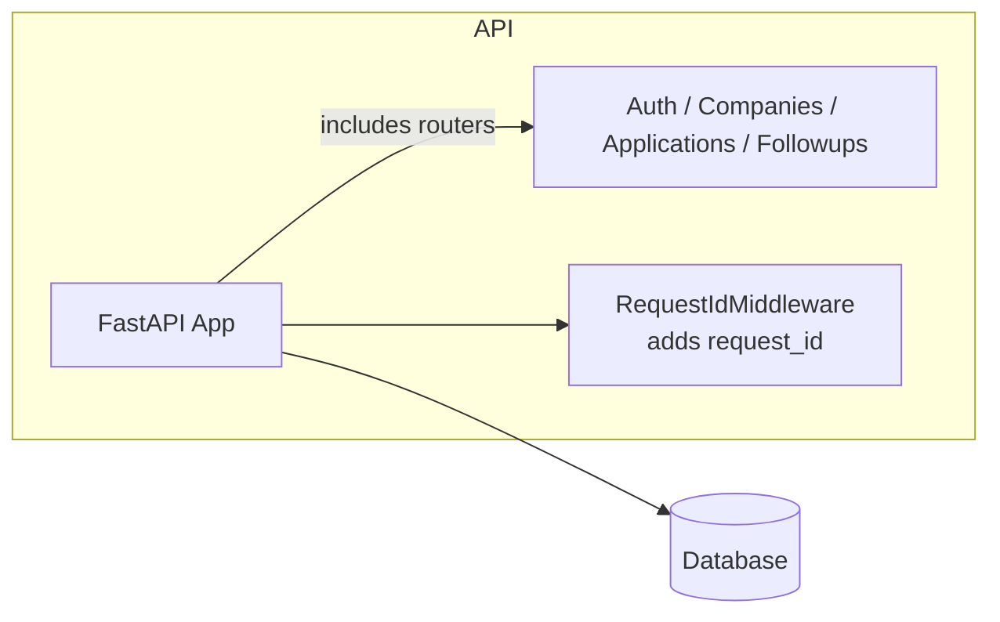

# Job Tracker API

[](https://github.com/nayfly/Job-Tracker-API/actions)

A simple FastAPI backend used to track job applications, companies and follow-ups.
This project is designed as a technical portfolio piece with:

- authentication (register/login) using JWT
- company & application CRUD operations
- follow-up notes tied to applications
- SQLite fallback for local development and testing
- SQLAlchemy + Alembic for data models and migrations


## Architecture



## Technical decisions & logging

* **Argon2 for password hashing** – new passwords are hashed with Argon2 (memory-hard, GPU-resistant). bcrypt is still accepted for backward
  compatibility. The helper `needs_rehash()` can be used to transparently
  upgrade legacy hashes on successful login
* **JWT with HS256** – symmetric signing keeps the implementation
  simple; tokens contain only the user email (`sub`) and expiration.
  HS256 is widely supported and appropriate for a single‑service API.

Request logging is structured and enriched with a `request_id` from
`app/middleware/request_id.py`. Every handler can include this ID in
logs to trace individual requests across async calls.

## Example JWT payload

```json
{
  "sub": "user@example.com",
  "exp": 1740000000
}
```

(The `access_token` is a base64‑encoded header.payload.signature string.)

## Getting Started

### Quickstart (<60 seconds)

```bash
# clone & prepare
git clone <repo> job-tracker-api && cd job-tracker-api
python -m venv .venv
.venv\Scripts\activate               # windows
pip install -e .[dev]

# run the app on localhost:8000 (default SQLite)
uvicorn app.main:app --reload &

# register/login, create company & application
curl -s -X POST http://localhost:8000/auth/register \
  -H 'Content-Type: application/json' \
  -d '{"email":"me@example.com","password":"pass1234"}'
TOKEN=$(curl -s -X POST http://localhost:8000/auth/login \
  -H 'Content-Type: application/x-www-form-urlencoded' \
  -d 'username=me@example.com&password=pass1234' | jq -r .access_token)

# create company and an application
curl -s -X POST http://localhost:8000/companies/ \
  -H "Authorization: Bearer $TOKEN" \
  -H 'Content-Type: application/json' \
  -d '{"name":"Acme","website":"https://acme"}' | jq

curl -s -X POST http://localhost:8000/applications/ \
  -H "Authorization: Bearer $TOKEN" \
  -H 'Content-Type: application/json' \
  -d '{"position":"Dev","company_id":1}' | jq

# filter, patch, dashboard
curl -s http://localhost:8000/applications/?status=applied \
  -H "Authorization: Bearer $TOKEN" | jq
curl -s -X PATCH http://localhost:8000/applications/1 \
  -H "Authorization: Bearer $TOKEN" \
  -H 'Content-Type: application/json' \
  -d '{"status":"interview"}' | jq
curl -s http://localhost:8000/applications/dashboard/summary \
  -H "Authorization: Bearer $TOKEN" | jq
```

The rest of this README documents the architecture, configuration, and
additional endpoints.  The above commands are sufficient to verify the API
is running.

### Python environment

```bash
python -m venv .venv
.venv\Scripts\activate   # Windows
# or source .venv/bin/activate on macOS/Linux
pip install -e .[dev]
```

The `pyproject.toml` defines dependencies and `ruff` for linting.
A `.pre-commit-config.yaml` is provided to run ruff and cleanup whitespace automatically.

### Configuration

Settings come from environment variables or a `.env` file.
The following variables are recognized (defaults shown):

| Name | Default | Description |
|------|---------|-------------|
| `ENV` | `local` | application environment (`test` triggers in-memory SQLite) |
| `SECRET_KEY` | `change-me` | JWT signing key |
| `DATABASE_URL` | computed | full SQLAlchemy URL, fallback to SQLite if not set |

For a simple local run you can leave `DATABASE_URL` unset and a file
`./db.sqlite3` will be used automatically. Tests set `ENV=test` and
use an in-memory database.

### Running the server

```bash
uvicorn app.main:app --reload
```

### Makefile helpers

A simple `Makefile` offers shortcuts:

```bash
make test      # run pytest
make lint      # run ruff and fix issues
make up        # start services via docker-compose (prod-like)
```

### Docker

There are two compose configs:

* `docker-compose.yml` – production‑like, builds the image, runs `api` and
  `db` without mounting source.  Use for CI or when you want a clean
  container.
* `docker-compose.dev.yml` – development mode; source is bind-mounted and the
  entrypoint script runs migrations then starts uvicorn.  It also brings up
  a local Postgres instance.  If the `alembic upgrade head` step fails the
  container exits (due to `set -e`), which is the desired behaviour.

Start dev: `docker compose -f docker-compose.dev.yml up --build`.

The entrypoint (`scripts/entrypoint.sh`) runs migrations and then launches
uvicorn; in dev it simply logs the failure and aborts if the migration step
fails, ensuring you don’t forget to apply schema changes.

API docs available at `http://localhost:8000/docs`.

### Running tests

```bash
pip install -e .[dev]
pytest -q
```

The test suite includes both unit and integration tests. A shared
`tests/conftest.py` sets up a temporary SQLite database and adjusts
FastAPI dependencies so the code under test uses the right engine.

### Linting

```bash
ruff check --fix .
```

## Database migrations

Alembic is configured in `alembic/`. To create a migration:

```bash
alembic revision --autogenerate -m "describe change"
alembic upgrade head
```

[](https://github.com/nayfly/Job-Tracker-API/actions)

## API Overview

| Method | Path | Params | Description |
|--------|------|--------|-------------|
| POST   | `/auth/register` | – | create user |
| POST   | `/auth/login` | – | obtain bearer token |
| GET    | `/health` | – | healthcheck (executes `SELECT 1`) |
| GET    | `/metrics` | – | Prometheus metrics |
| GET    | `/companies/` | – | list companies |
| POST   | `/companies/` | – | create company |
| DELETE | `/companies/{id}` | – | delete company |
| GET    | `/applications/` | `status`, `company_id`, `limit`, `offset`, `order_by`, `desc` | list with paging/filter/sort |
| POST   | `/applications/` | – | create application |
| PATCH  | `/applications/{id}` | – | partial update |
| DELETE | `/applications/{id}` | – | delete application |
| GET    | `/applications/dashboard/summary` | – | counts by status + recent followups |
| GET    | `/followups/` | `application_id` | list notes for app |
| POST   | `/followups/` | – | create followup note |
| DELETE | `/followups/{id}` | – | delete note |

Authentication is required for most endpoints. Use the returned JWT in
`Authorization: Bearer <token>` header.

## Notes

*The login endpoint applies a simple in-memory rate limit (5 attempts per
minute per email address, sliding window).  This is a demo‑only guard; if the
email changes the counter resets.  A real system would combine IP-based
throttling or use a shared cache.*

Designed for portfolio/demo use: defaults favor fast local execution 
(SQLite) and deterministic tests. For production: configure Postgres, rotate
secrets, enforce HTTPS, and consider asymmetric JWT signing.
